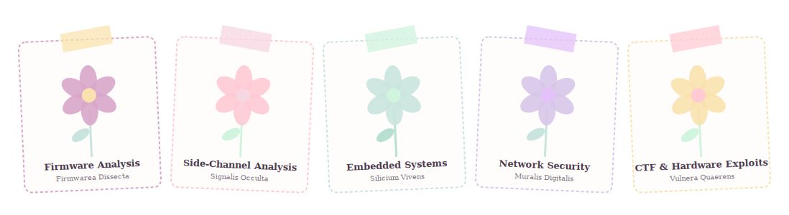

<div align="center">


<br>

### 🌷 *Tender of the garden: Hardware security researcher* 🔩

</div>

<br>


## 🪴 About the garden

I'm an Electronics & Telecommunication Engineering student at Mumbai, growing things at the intersection of **Electronics, Cybersecurity, and systems that touch the physical world**. My focus is embedded and IoT security; the layer where a chip's firmware, its silicon, and its side channels all become the attack surface.

I like taking things apart to understand how they fail, then writing about it clearly enough that someone else can learn from it too. Half CTF player, half storyteller.

```
🔭 Currently:    Embedded systems & IoT security research @ CoE CNDS
🌷 Leading:      Cyber Tinkerers' Club (Founding Technical Officer)
```

<br>

## 🧵 The technical thread

<div align="center">

</div>

<br>

**Hardware & embedded**
<br>
   

**Languages & stack**
<br>
   

**Tools of the trade**
<br>
    

**The workbench** *(hardware rig)*
<br>
      

<br>


## 🎀 Pressed flowers (milestones)

| | |
|---|---|
| 🏆 | **2× National Hackathon Winner** |
| 🚩 | **Placed internationally and nationally in CTF competitions** - with an intra-college win too!|
| 📜 | **CompTIA Security+ certified** (2026) |
| 🎓 | **CGPA 9.5**, EXTC, VESIT Mumbai - Class of 2027 |
| 🦔 | **Founding Technical Officer**, Cyber Tinkerers' Club - building a hardware/security community from zero |

> 🔒 **The locked drawer:** a good part of my hardware security work: internship research, active disclosures, contributions, is under confidentiality and can't be shown here. It's real, it's ongoing, and I'd genuinely love to talk through it if you reach out directly 🌸

<br>


## 🧷 Projects on the shelf

- **CyberEdge-001** - an ESP32-based portable security toolkit for learning cybersecurity
- **Drone Mirage** - autonomous drone systems work, blending robotics with security-aware design
- **KIMAYA** & **MAYA** - automation systems and architectures spanning agriculture and assistive applications
- **Theremidi** - a fusion of Theremin with the MIDI protocol
- **SafeLabs** - safety automation for lab environments
- **Smart Parking System** - self explanatory (a 1-day sprint to challenge the electronics student in me hehe)

*(and a few more still growing quietly in the private greenhouse 🌱)*

<br>

## 📔 The other pages

Outside the terminal, I write and do voice acting; scripts, characters, the occasional animation voiceover. I think the best engineers in hardware security are also the ones who can explain *why* a fault-injection attack matters to someone who's never held a chip. Clear communication is a security skill too!

<br>

<div align="center">

Let's talk hardware, security, or storytelling 🌷

<a href="https://linkedin.com/in/sanisa-patrikar"></a> <a href="https://beyondthespeakingmind.wordpress.com"></a> <a href="https://instagram.com/beyond_the_speaking_mind"></a> <a href="mailto:sanisapatrikar09@gmail.com"></a>

<br><br>

 </div>
